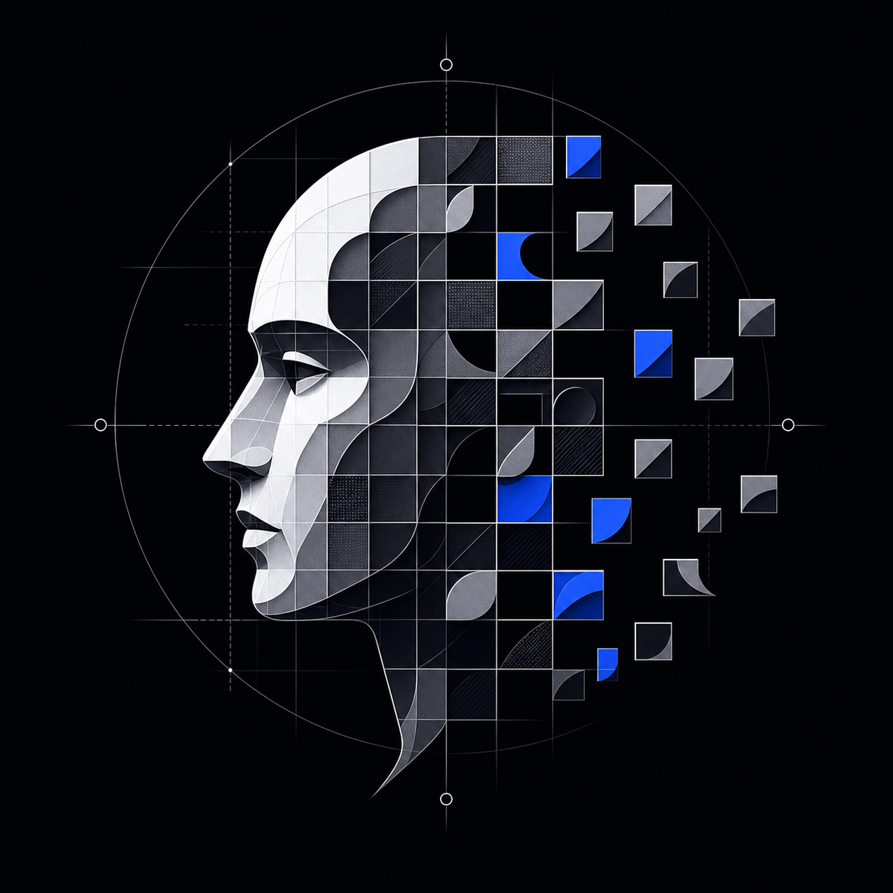
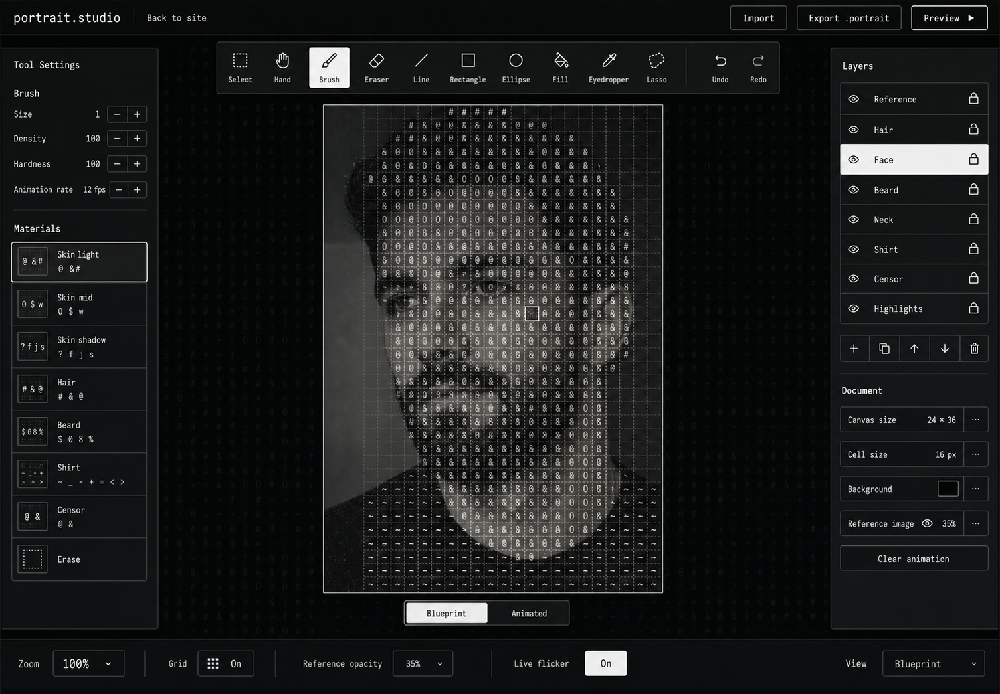
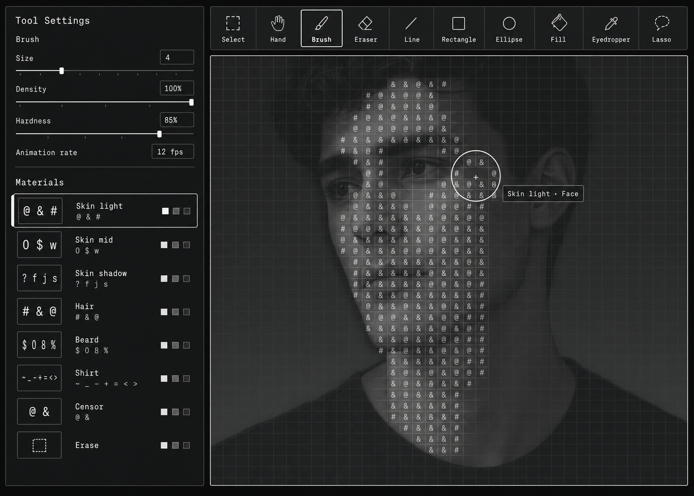

# Portrait Studio

<p align="center">
  
</p>

Portrait Studio is a local-first editor for creating animated portraits from typographic glyphs. Instead of applying a visual filter to a finished image, the editor turns a portrait into a structured document whose cells know what they represent: skin, hair, shadow, clothing, outline, or another semantic material.



## What the app is for

The project explores a more intentional way to make ASCII and halftone portrait art. Artists can trace a reference image, decide which glyph family belongs to each part of the portrait, preview how those glyphs animate, and export a reusable document that renders consistently at different screen sizes.

The result is not a flattened screenshot. It is an editable `.portrait` file with layers, material identities, intensity values, animation settings, and a deterministic renderer.

## User flow

1. **Start from a reference** by using the included portrait or importing another source image.
2. **Organize the portrait into layers** for areas such as the face, hair, beard, shirt, highlights, and outline.
3. **Choose a semantic material** and paint with its glyph family using the brush, shape, fill, selection, or lasso tools.
4. **Refine the composition** with opacity controls, layer ordering, duplication, undo and redo, pan, zoom, and trackpad gestures.
5. **Switch between Blueprint and Animated modes** to check exact cell placement and motion behavior.
6. **Open Live Preview** to see the document in the same renderer used by the final experience.
7. **Export the work** as a lossless `.portrait` project or a PNG preview. Imported `.portrait` files remain fully editable.



## Highlights

- Ten editing tools: Select, Hand, Brush, Eraser, Line, Rectangle, Ellipse, Fill, Eyedropper, and Lasso
- Semantic material families with editable glyph sets, intensity, and flicker behavior
- Layer creation, duplication, ordering, visibility, locking, and deletion
- Blueprint, animated canvas, and exact live-renderer previews
- Lossless `.portrait` import and export with stable, versioned serialization
- PNG preview export for sharing finished work
- IndexedDB autosave with a localStorage fallback
- Keyboard shortcuts plus trackpad pan and pinch gestures
- Responsive tool and layer panels for smaller screens
- A shared sampling pipeline so editor and live output stay visually consistent

## How it works

Portrait Studio uses a fixed 192 by 288 master grid. Every authored cell stores a material ID and an 8-bit intensity value. Layers keep those cells in compact typed arrays, while exported projects encode them with lossless pair run-length encoding.

Animation changes the visible glyph, scale, alpha, shimmer, breathing, and timing within a material's allowed behavior. It never changes the underlying silhouette or material ownership. This separation keeps the artwork editable while allowing the final portrait to feel alive.

More detail about the document contract, renderer, validation, and material runtime is available in [the architecture notes](docs/portrait-editor/README.md).

## Built with

- Next.js 16 and React 19
- TypeScript
- CSS Modules
- Canvas-based raster editing and preview rendering
- IndexedDB and localStorage
- Vitest and Testing Library

## Run locally

```bash
npm install
npm run dev
```

Open [http://localhost:3200](http://localhost:3200).

Your draft stays in the browser for that origin. To move work from another deployment or port, export it as a `.portrait` file and import it into this Studio instance.

Imported reference images are traced locally. The editable semantic document is autosaved and exported, but the original image file is not embedded in the `.portrait` project.

## Quality checks

```bash
npm run typecheck
npm run lint
npm test
npm run build
```

## Project map

```text
src/
  app/                         Next.js entry point and global styles
  components/portrait-editor/ Editor interface and canvas
  components/HalftonePortrait Live animated renderer
  hooks/                       Editor state and autosave integration
  lib/                         Document model, codec, raster tools, sampling, and runtime
docs/portrait-editor/          Architecture notes and design references
public/portrait.png            Included source portrait
```

## Design principle

The editor and the final renderer share the same document model and sampling rules. That means the authoring preview is not an approximation of the shipped result. What an artist builds in the Studio is the same structured portrait the live renderer receives.
